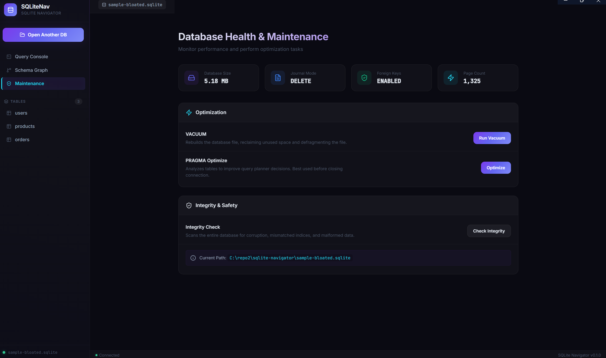
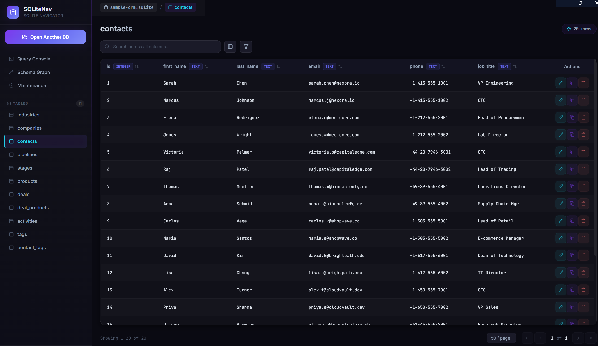
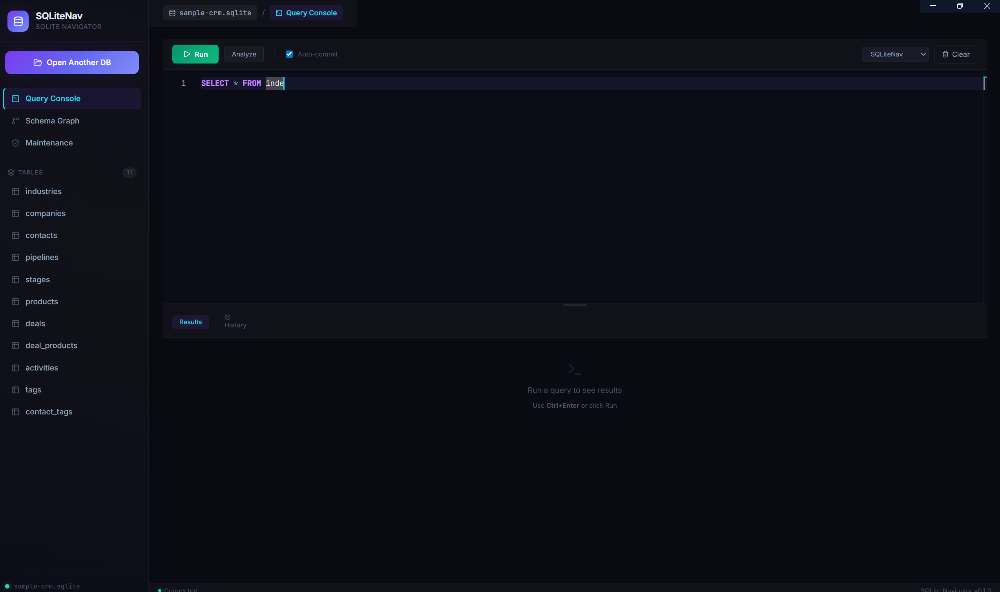
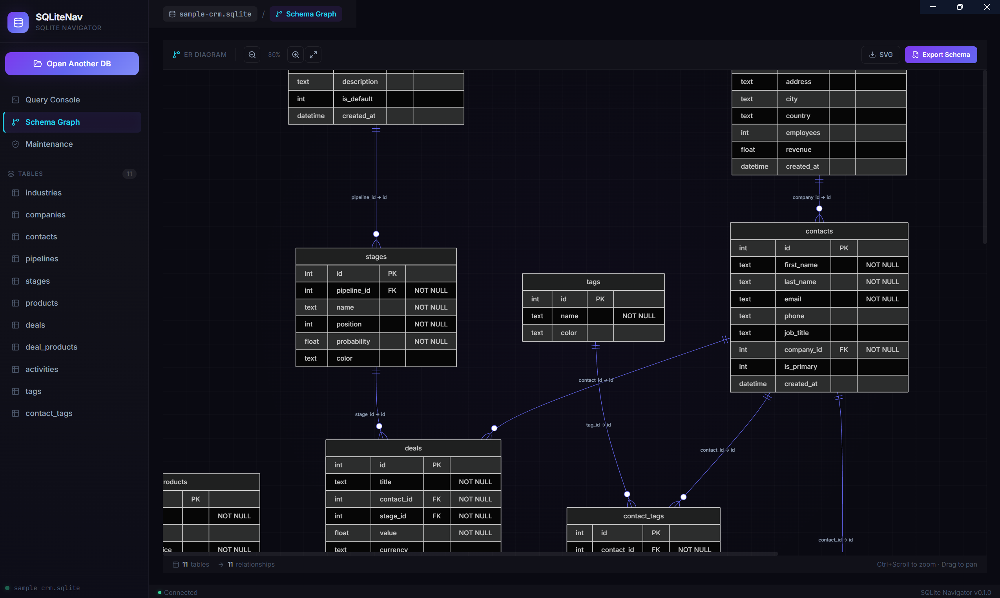

# SQLiteNav

A premium, feature-rich SQLite database explorer and management studio built with React, Electron, and better-sqlite3.

## Features

### 📊 Modern Dashboard & Maintenance
Sleek dark theme with glassmorphism, real-time database health monitoring, and one-click optimization tools (Vacuum, Integrity Check).


### 🗂️ Data Explorer
High-performance table view with server-side sorting, advanced filtering, and pagination. Double-click any cell for **Inline Editing**.


### 💻 Advanced Query Console
Pro-grade SQL editor powered by Monaco. Includes context-aware autocompletion, multi-theme support, and a **Visual Query Plan** analyzer.


### 🕸️ Schema Graph
Professional mermaid-based visualization of your database structure, tracking foreign key relationships and UML exports.


## Tech Stack

- **Frontend**: React 19, TypeScript, Vite, Framer Motion, Lucide Icons.
- **Editor**: Monaco Editor (via @monaco-editor/react).
- **Visualization**: Mermaid.js for Schema Graphs.
- **Backend**: Electron, better-sqlite3.
- **Styling**: Vanilla CSS with modern variables and animations.

## Installation

For the latest stable version, visit the [Releases](https://github.com/oliver021/SQLite-navigator-app/releases) page and download the installer for your operating system:

- **Windows**: Download the `.exe` installer.
- **macOS**: Download the `.dmg` file.
- **Linux**: Download the `.AppImage` file.

> [!IMPORTANT]
> **Security Note**: As this application is not digitally signed with a commercial certificate, your OS may show a security warning.
> - **Windows**: Click "More info" and then "Run anyway".
> - **macOS**: Right-click the app and select "Open", or go to System Settings > Privacy & Security to allow the app.

## Development

1. Install dependencies:
   ```bash
   npm install
   ```
2. Start the development server:
   ```bash
   npm run dev
   ```
3. Open a SQLite database file and start exploring!
